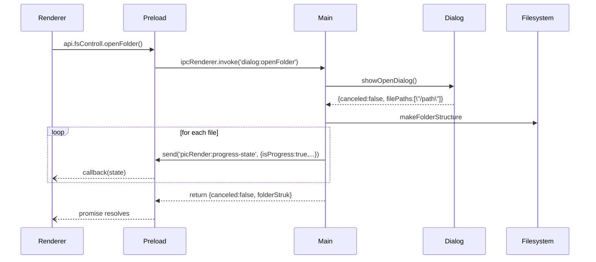
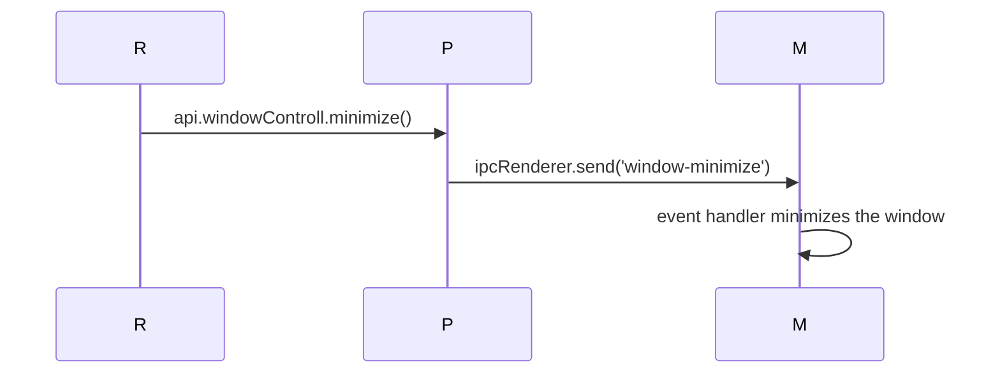

# IPC Protocols 📡

This document describes inter-process communication channels used between the renderer process and the main process in the Electron application. The preload script (`src/preload/index.ts`) exposes a thin API that forwards events over these channels.

## Summary

* Renderer → Main: request actions (`dialog:openFolder`, `window-*`, `dark-mode:*`).
* Main → Renderer: progress notifications (`picRender:progress-state`), one‑off replies from `ipcMain.handle` invocations.

All channels use the standard `ipcRenderer.send` / `ipcRenderer.invoke` APIs.

## Channel list

| Channel                    | Direction        | Payload / Return                              | Description                                   |
|----------------------------|------------------|-----------------------------------------------|-----------------------------------------------|
| `dialog:openFolder`        | R → M (invoke)   | none → `HandleFolderOpenResponse`             | open native folder picker                     |
| `picRender:progress-state` | M → R (on)       | `{isProgress, items, itemsDone}`              | thumbnail generation progress                 |
| `window-minimize`          | R → M            | none                                          | minimize calling window                       |
| `window-close`             | R → M            | none                                          | close calling window                          |
| `window-toggle-maximize`   | R → M            | none                                          | toggle maximize/restore                       |
| `dark-mode:toggle`         | R → M (handle)   | none                                          | flip dark/light mode                          |
| `dark-mode:system`         | R → M (handle)   | none                                          | use system theme                              |
| `dark-mode:state`          | R → M (handle)   | none → `"light" | "dark" | "system"` | query current theme state                     |

## Sequence diagrams

### Folder open + progress

### Window controls example

## Notes

* `pictureRender.progressState` is implemented as a subscription in the preload: each time the main sends `'picRender:progress-state'`, the supplied callback is executed. There is no mechanism to unsubscribe; if components mount/unmount frequently consider adding cleanup.
* The IPC channels associated with dark mode follow the naming convention `domain:action` and are handled using `ipcMain.handle` when a result is expected.

