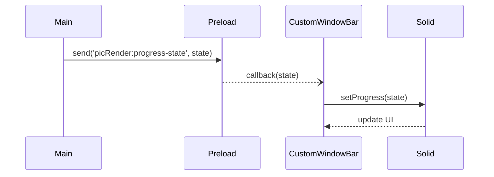

# SolidJS Signal & Store Flow 📈

This section explains how reactive state (signals) and any stores are used in the renderer. SolidJS relies on fine‑grained reactivity; components subscribe to signals and recompute when those signals change.

## Signals in Components

Inspecting the components in `src/renderer/src/components` reveals only a handful of local signals:

| Component               | Signal(s)                                       | Purpose                                  |
|-------------------------|-------------------------------------------------|------------------------------------------|
| `CustomWindowBar`       | `progress`                                      | Track thumbnail generation progress      |
| `FolderList` / others   | (likely own signals for selection & expand)     | UI state (not inspected here)           |

`CustomWindowBar` sets up `progress` via `createSignal` and updates it in the IPC callback from `window.api.pictureRender.progressState`. A `<Show>` control conditionally renders the progress bar based on `progress().isProgress`.

### Example flow

1. Main process sends `picRender:progress-state` event with `{isProgress:true,...}`.
2. Preload forwards to callback registered by `CustomWindowBar`.
3. Callback calls `setProgress(state)`.
4. SolidJS reactivity triggers a re-render of `CustomWindowBar`; the `<Show>` displays or updates the `<Progress>` component.

Mermaid sequence diagram:

## Stores & Memory

This project does not appear to use SolidJS stores (`createStore`) or the built-in `createSignal` outside of components; there is no centralized global state module. The folder tree and current image are presumably passed down via props from the main `App.tsx` component.

If future requirements call for shared state (e.g. selected folder or image index), introducing a store or context provider would be straightforward.

## IPC Integration as Reactive Source

The progress IPC channel acts effectively as an external reactive source. The pattern of having the preload relay events into a signal-setter is idiomatic and keeps side-effects localized to the component.

## Recommendations

* Consider debouncing or throttling updates if the main process emits very frequent progress events to avoid UI jank.
* If multiple components need progress data, elevate the `progress` signal to a store in `App.tsx` and provide access via context.

