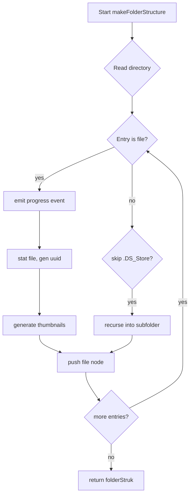

# `filesystem.ts`

**TLDR;**
Utility module running in the Electron main process. It recursively scans a directory tree and builds an in-memory `FolderItem` structure representing files and subfolders. While walking the tree it generates thumbnails via `imageRender` and emits progress events over IPC. Also provides a helper to clean the temporary cache directory.

---

## Overview

This file lives under `src/main/lib` and is purely backend code executed in the main process. It exposes two functions:

* `makeFolderStructure(event, path)` – asynchronous recursive directory walker that returns a `FolderItem` tree.
* `cleanTempFolder()` – synchronous helper that removes the temporary thumbnail cache.

The module imports low‑level Node APIs (`fs`, `path`, `crypto`) and the `app` object from Electron to locate the OS temp directory. Thumbnails are generated using helpers from `imageRender.ts`.

## Public API

```ts
export async function makeFolderStructure(event, path: string): Promise<FolderItem>
export function cleanTempFolder(): number
```

### makeFolderStructure

* Reads the contents of `path` with `fs.promises.readdir`.
* Builds a root `FolderItem` object.
* Iterates over entries, emitting a `picRender:progress-state` IPC message for each file to give the renderer progress updates.
* Determines whether an entry is a file (simple regex `/.+\..+/`) or a subfolder. Files trigger:
  * `fs.promises.stat` to gather metadata
  * UUID generation for unique IDs
  * Thumbnail generation via `generateThumbnail` (small and big versions)
  * Creation of a `FolderItem` with `fileStats` attached.
* Non-file entries are treated as directories and recursed into. The recursion is tail‑recursive and accumulates children.
* The final `FolderItem` tree is returned to the caller.

A flowchart describing the algorithm:



### cleanTempFolder

Removes `spv-cache` under the OS temp directory using `fs.rmSync` and returns 0. Called on application shutdown to avoid stale data.

## Notes and suggestions

* Progress messages currently set total `items` to 1000 hard‑coded; consider computing real totals.
* Path concatenation uses string concatenation (`path + '/' + dir[i]`) which can misbehave on Windows; using `path.join` would be safer.
* The code reads the same `readdir` twice for nested folders („nicht effizient“ comment) – this could be optimized by passing the `dir` array into the recursive call.
* Error handling is minimal; any I/O error will reject the promise and bubble up to the caller.

---

## Program flow diagrams

The above flowchart captures the file‑system traversal algorithm. For a sequence diagram showing IPC interaction, see `docs/architecture/ipc-protocols.md`.

