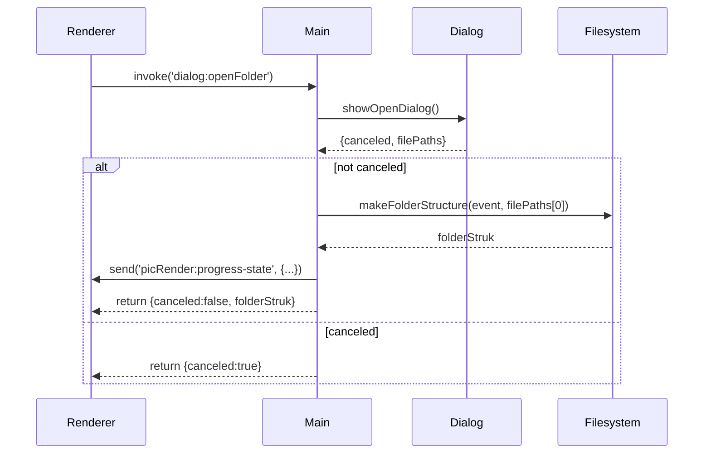

# `filesystemHandlers.ts`

**TLDR;**
Defines IPC handlers in the main process for opening folders via a native dialog and returning the folder structure to the renderer. Delegates folder scanning to `makeFolderStructure`.

---

## API

```ts
export function registerFilesystemHandler(): void
export async function handleFolderOpen(event): Promise<HandleFolderOpenResponse>
```

### registerFilesystemHandler

* Registers a handler for the `dialog:openFolder` channel using `ipcMain.handle`.
* When invoked from the renderer, it calls `handleFolderOpen`.

### handleFolderOpen

* Invokes `dialog.showOpenDialog` with `{ openDirectory, multiSelections }`.
* If the user selects a directory, calls `makeFolderStructure` with the event and path.
* Sends a final `picRender:progress-state` message indicating completion.
* Returns an object conforming to `HandleFolderOpenResponse` exported from `preload/index.d.ts`.

## Sequence Diagram



## Notes

* Progress messages are hardcoded; see `filesystem.ts` comments for improvement.
* `multiSelections` is enabled but only the first folder is used.
* No error handling for dialog failures beyond propagation.

