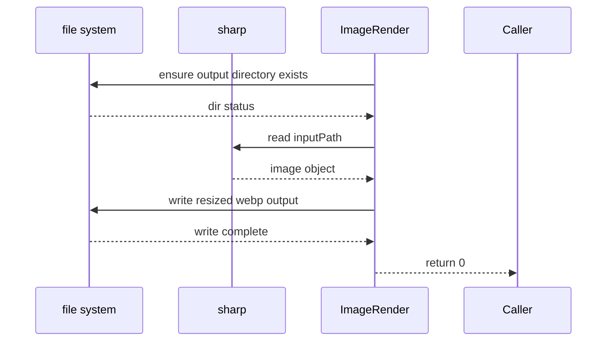

# `imageRender.ts`

**TLDR;**
Contains utilities for generating WebP thumbnails and computing file paths in the temporary cache directory. Used by `filesystem.ts` when building the folder tree.

---

## Responsibilities

* `generateThumbnail(inputPath, outputPath, size, quality)` – read an image file using [`sharp`](https://github.com/lovell/sharp), resize it, and write a WebP file with the requested quality.
* `getThumbnailPath(fileId, type)` – construct a path inside the OS temp directory (`spv-cache`) for a given UUID and size category (`big` or `small`).

Both functions are synchronous or simple promise-returners and do not rely on Electron APIs except to compute `app.getPath('temp')`.

## API

```ts
export async function generateThumbnail(
    inputPath: string,
    outputPath: string,
    size: number,
    quality: number
): Promise<number>

export function getThumbnailPath(fileId: string, type: 'big' | 'small'): string
```

### generateThumbnail

Flow:

1. Create a `sharp` pipeline for `inputPath`.
2. Ensure the directory for `outputPath` exists; create it if necessary.
3. Clone the pipeline, resize, convert to WebP with provided `quality`, and write to disk.
4. Log progress and return `0` on success, `1` if directory creation unexpectedly failed.

Mermaid sequence diagram:



### getThumbnailPath

Simple helper that returns `<temp>/spv-cache/<uuid>_thumb_small.webp` or `..._big.webp` based on `type`.

## Notes

* The `resize` operation is hardcoded to preserve aspect ratio but does not supply a fit parameter; large or tall images may behave unpredictably.
* No cache invalidation logic; callers must handle overwrites.

---

## Algorithms

See `docs/architecture/algorithms.md` for an overview of the thumbnail-generation pipeline and other bespoke algorithms.

