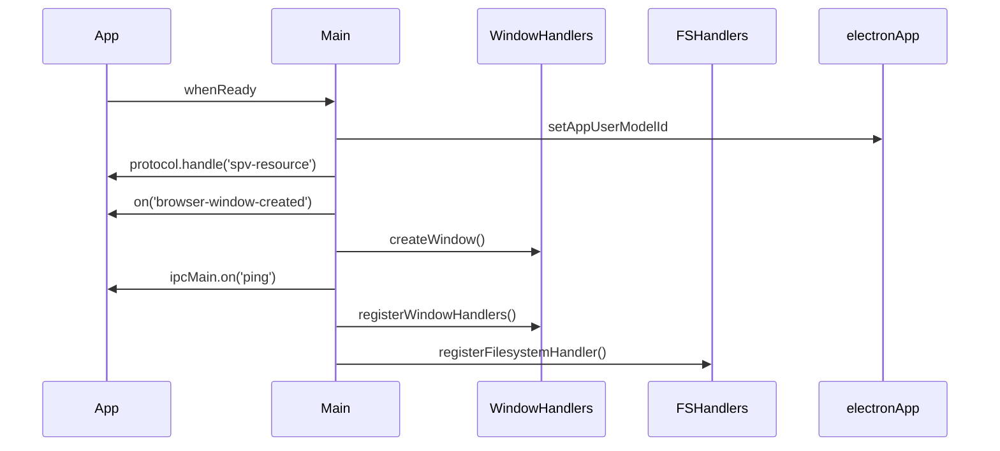

# `index.ts` (main entry point)

**TLDR;**
Bootstraps the Electron application. Registers custom protocols, creates the main browser window, sets up IPC handlers and lifecycle hooks, and cleans up temporary data on exit.

---

## Responsibilities

* Configure `spv-resource` custom protocol for loading local files in renderer.
* Prepare application when `app.whenReady()` resolves:
  * Set up Electron utilities (`electronApp.setAppUserModelId`).
  * Register protocol handler.
  * Initialize global shortcuts and dev tools via `@electron-toolkit/utils`.
  * Create the main window using helpers from `windowHandlers.ts`.
  * Register IPC handlers for window controls and filesystem operations.
* Manage app lifecycle events (`activate`, `window-all-closed`, `quit`) with appropriate cleanup.

## Lifecycle

The core of the startup sequence is in the `app.whenReady()` promise. The sequence is roughly:

Cleanup events:

* `window-all-closed`: quits app and calls `cleanTempFolder()` on non‑Darwin platforms.
* `quit`: always invokes `cleanTempFolder()`.

## IPC

See `docs/architecture/ipc-protocols.md` for details on each channel.

## Notes

* Some commented-out code references a `MessageChannelMain` port which is unused; remove or implement.
* The `is.dev` check ensures hot module reloading in development.
* The protocol handler simply rewrites a custom scheme to a file:// URL and fetches it via `net.fetch`, enabling the renderer to load packaged assets in production.

---

## External Dependencies

* `@electron-toolkit/utils` – helper for managing development shortcuts and app id.
* Node builtins: `app`, `BrowserWindow`, `ipcMain`, `protocol`, `net`.

