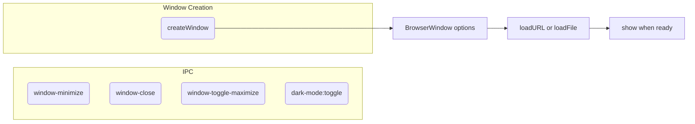

# `windowHandlers.ts`

**TLDR;**
Provides two sets of helpers for the Electron main process: IPC handlers that implement window control and dark mode toggling, and a factory function to create the main application BrowserWindow with custom appearance options.

---

## Exported Functions

```ts
export function registerWindowHandlers(): void
export function createWindow(): BrowserWindow
```

### registerWindowHandlers

Registers several IPC channels using `ipcMain.on`/`handle`:

* `window-minimize` – minimize the sender's window.
* `window-close` – close the sender's window.
* `window-toggle-maximize` – toggle maximized state.
* `dark-mode:toggle` – switch between light and dark themes.
* `dark-mode:system` – revert to system theme.
* `dark-mode:state` – return the current theme source.

These channels are consumed by the renderer via `window.api.windowControll`.

### createWindow

Constructs and configures a `BrowserWindow` instance. Key options:

* `frame: false` and `titleBarStyle: 'hidden'` to allow a custom title bar (traffic light buttons handled manually).
* `webPreferences.preload` points to the packaged preload script.
* `vibrancy`, `autoHideMenuBar`, and platform‑specific icon.

Adds event listeners for `ready-to-show` and intercepts external links to open in the default browser.

Includes logic to load a development URL when `is.dev` is true; otherwise it loads the local HTML file.

## Program Flow



## Notes

* `ipcMain.on` callbacks locate the originating `BrowserWindow` via `BrowserWindow.fromWebContents`.
* The module imports an `icon` asset via Vite's `?asset` loader.
* The dark-mode handlers log to the console; this mimics the renderer API but is otherwise straightforward.
* There is no handler for `window-maximize` separate from toggle; the renderer may rely on toggle for both maximize and unmaximize.

---

## IPC Protocols Overview

The complete list of channels and payload shapes is documented in `docs/architecture/ipc-protocols.md`.

