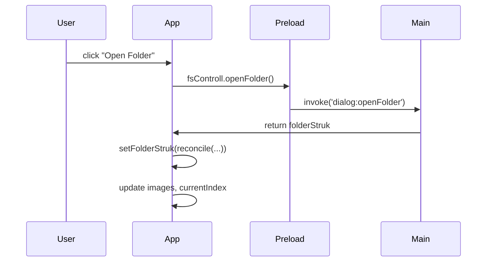

# `App.tsx`

**TLDR;**
The root SolidJS component orchestrating the application. Manages global state such as the current folder structure, image list, selected image/folder, and sidebar visibility. Handles IPC for opening folders and keyboard shortcuts.

---

## State

* `showFolderSidebar`, `showDetailsSidebar` – toggles for sidebar visibility.
* `images`, `currentIndex` – list of images in the current folder and the currently viewed index.
* `selectedFolder` – ID of the folder selected in the sidebar.
* `folderStruk` – store containing the folder tree received from the main process; uses `createStore` and `reconcile` for efficient updates.
* `currentPath` – array of IDs representing the path from root to the selected folder.
* `currentFolder` – memoized getter returning `getFolder(folderStruk, currentPath())`.

## Handlers

* `handleOpenFolder()` – invokes IPC to open folder, updates `folderStruk` and resets image selection.
* `handleNavigate(direction)` – move to previous/next image.
* `handleSelectImage(index)` – set current index directly.
* `handleMarkToggle(fileId)` – toggles the `marked` flag both in `folderStruk` store and the `images` signal.
* `handleCategoryChange(category)` – placeholder for category update logic.
* `handleFolderSelect(folderId)` – switch to a folder, compute corresponding path, update `images` list with files from that folder.
* `handleFileSelect(fileId)` – select a file by ID; if not in current list, change folder first.

## Keyboard shortcuts

A global `keydown` listener intercepts:

* Arrow keys for navigation.
* Space for mark toggle.
* Cmd/Ctrl+Shift+F/D to toggle sidebars.
* Home/End to jump to first/last image.

## Rendering

Layout consists of `CustomWindowBar` at the top, a horizontal `div` containing the optional `FolderSidebar`, `ImageViewer` in the center, and optional `DetailsPanel`. `ImageCarousel` is rendered below the window bar only when a folder is selected.

## IPC and Data Flow

* `handleOpenFolder` communicates with the main process; the returned `folderStruk` is reconciled into the store, which triggers updates across components.
* State changes (e.g. folder selection) propagate downward via props.

### Diagram

## Notes

* Many features (category assignment, folder creation) are incomplete or commented out.
* `sampleImages` and `emptyFolderStruk` provide default placeholder state for development.

