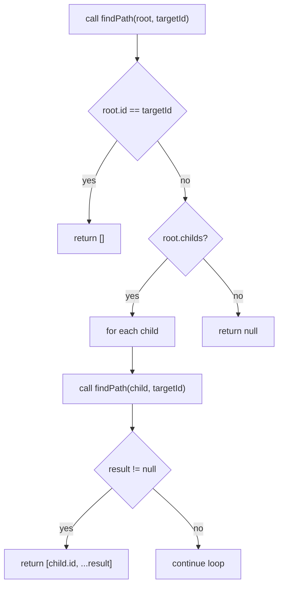

# `folderStrukHelpers.ts` (renderer lib)

**TLDR;**
Contains pure functions for traversing the `FolderItem` tree structure sent from the main process. Provides lookup by ID and utilities to compute paths within the tree.

---

## Exported functions

* `getFolder(folderStruk, path)` – walks down the tree following an array of `id` values (`path`) and returns the node at that location.
* `findPath(root, targetId)` – depth-first search to find the sequence of IDs from `root` to the node with `targetId`.
* `findIndexPath(root, targetId)` – similar to `findPath` but returns indices at each level (0-based) rather than IDs.

Each function is generic and recursive.

## Algorithms

`findPath` pseudocode:

```text
function findPath(node, targetId):
    if node.id == targetId return []
    if node.childs:
        for each child in node.childs:
            sub = findPath(child, targetId)
            if sub != null return [child.id, ...sub]
    return null
```

`findIndexPath` uses similar recursion but pushes numeric indices.

Mermaid flowchart for `findPath`:



## Usage

These helpers are used by components such as `FolderList` and `FolderSidebar` to manage selection, expansion, and navigation within the folder tree. They keep UI logic out of the components themselves.

## Notes

* The functions assume `id` values are unique.
* They perform full traversal; for very large directories performance may become noticeable. Caching results or indexing could be considered.

---
