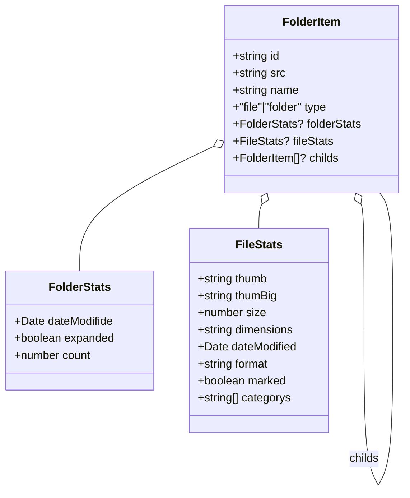

# `filesystem.d.ts`

**TLDR;**
Defines the shared data structures representing files and folders within the application. Used throughout the main process for scanning directories and in the renderer for displaying the folder tree.

---

## Interfaces

* `FileStats` – metadata about a file, including thumbnail paths, size, dimensions, modification date, format, and user state (`marked`, `categorys`).
* `FolderStats` – metadata about a folder including last modified date, whether it's expanded in the UI, and the number of direct children.
* `FolderItem` – union type representing either a file or a folder. Contains an `id` UUID, source path, display name, `type` discriminator, and optional `folderStats` / `fileStats` fields. Folders may also include a `childs` array of further `FolderItem` objects.

These types are imported both in the backend and frontend code to maintain consistency.

```ts
interface FolderItem {
    id: string
    src: string
    name: string
    type: 'file' | 'folder'
    folderStats?: FolderStats
    fileStats?: FileStats
    childs?: Array<FolderItem>
}
```

## Usage

* `main/lib/filesystem.ts` constructs `FolderItem` trees while scanning directories.
* IPC handlers send `FolderItem` objects to the renderer as part of `HandleFolderOpenResponse`.
* Renderer helpers (`folderStrukHelpers.ts`, UI components) traverse and display these structures.

---

## Diagram



